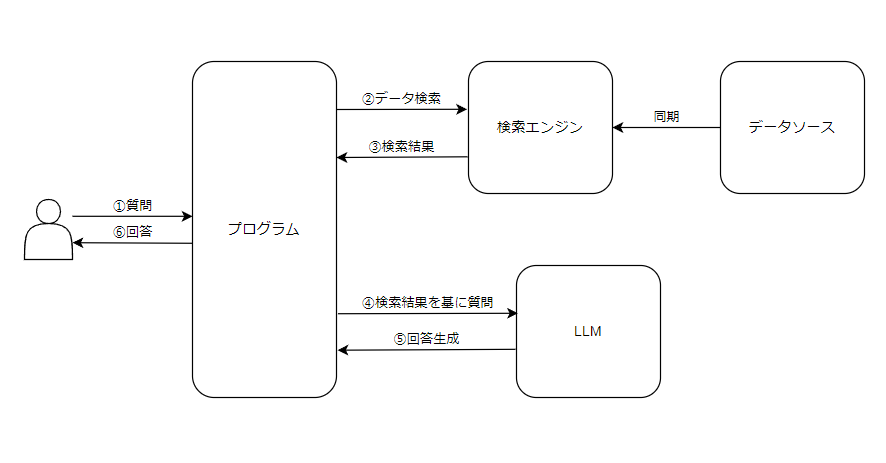
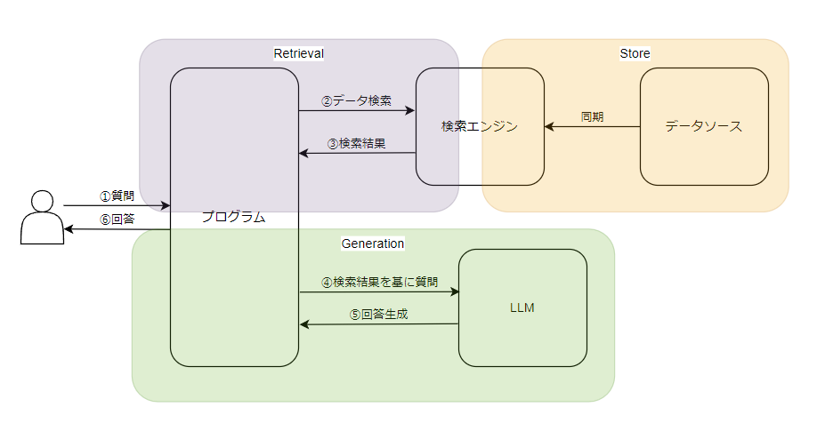
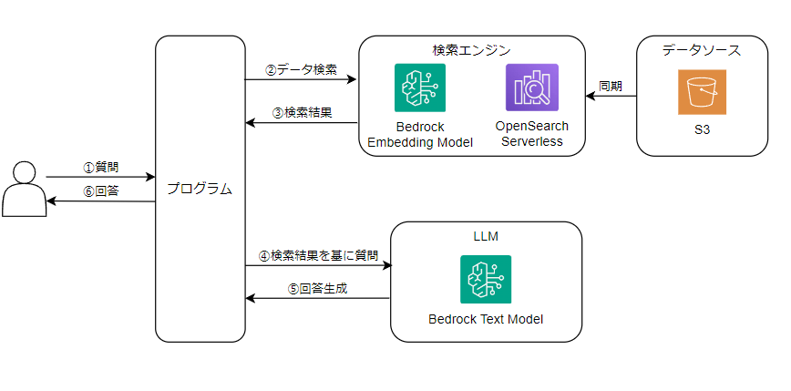
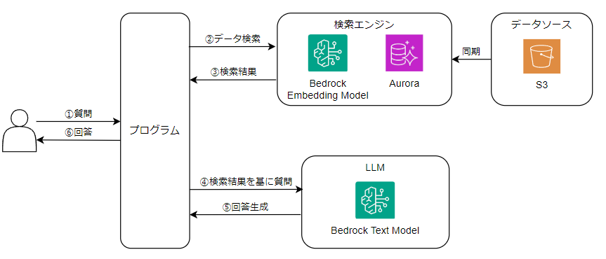

# RAGについて

- RAGとは *(Retrieval Augmented Generative)** の略  
- 生成AIにデータの検索結果を与えることで、回答生成性能を向上させる手法です。
近年、社内データをRAGで活用する事例が増えており、RAGの概要とその活用方法について説明します。

## なぜRAGが必要か？

一般的な生成AIでは特定時点のパブリックな情報しか学習種ていないため、より専門性の高い回答や自社内で扱われている情報の回答が困難である。  
この問題に対して、独自データを持った外部DBに参照データを格納し回答を行うRAGの仕組みを用いることで一般的でない回答を行う生成AIを構築することができる。

## RAGの仕組み

### 1. **Storeフェーズ**
- 外部データソースから関連情報を収集。
- 収集した情報を分割し、検索エンジンが使用するデータベースに保存。

### 2. **Retrievalフェーズ**
- 検索エンジンを用いて類似ドキュメントを検索。
- 抽出されたドキュメント内容のみを結果として返答。

### 3. **Generationフェーズ**
- 検索結果を参照先としてLLMにプロンプトを返す。
- LLMがドキュメントに基づいて回答を生成。

---

## RAGを理解する上での重要な概念

### **チャンキング**
- 大きなドキュメントデータを小さな断片（チャンク）に分割。
- 適切なチャンクサイズと分割方法により検索精度と生成品質が向上。

### **エンベディング**
- テキストや画像などのデータを数値ベクトルに変換。
- データの意味や関連性を数学的に表現することで、類似検索が可能に。

### **ベクトルデータベース**
- 数値ベクトルを効率的に保存し、ベクトル検索を実施するデータベース。
- **ベクトル検索**: 数値ベクトルの類似度を比較し、関連性の高いデータを検索。

---

## AWSで組めるRAGパターン

### AWSのRAG検索エンジンサービス
- **Amazon Kendra**
- **Knowledge Base for Amazon Bedrock**
  - 基盤モデルを用いてRAGを実現するAmazon Bedrockの機能。
  - データベースのドキュメント情報をエンベディングに変換し、ベクトルデータベースに保存。
  - ベクトルデータベースを検索することで関連性の高い回答を提供。

### KendraとBedrockの比較
#### 1. サービスの概要

| 項目         | **Amazon Kendra**                                    | **Knowledge Base for Amazon Bedrock**                       |
| ------------ | ---------------------------------------------------- | ----------------------------------------------------------- |
| **目的**     | 高度な検索機能を提供するエンタープライズ検索サービス | RAG（Retrieval Augmented Generative）パターンを支援する機能 |
| **主な用途** | ドキュメント検索、FAQ検索                            | LLM（大規模言語モデル）に関連データを提供し回答を生成       |

---

#### 2. データソースと統合

| 項目                 | **Amazon Kendra**                   | **Knowledge Base for Amazon Bedrock**                 |
| -------------------- | ----------------------------------- | ----------------------------------------------------- |
| **対応データソース** | 100種類以上の事前定義コネクタを提供 | S3、サードパーティベクトルDBを利用                    |
| **カスタムデータ**   | 独自のデータソースを統合可能        | エンベディング生成後にベクトルデータベースに格納      |
| **同期機能**         | ネイティブでスケジューリング可能    | EventBridge Scheduler + StepFunction で同期処理を構築 |

---

#### 3. 検索とエンベディング

| 項目                   | **Amazon Kendra**         | **Knowledge Base for Amazon Bedrock**        |
| ---------------------- | ------------------------- | -------------------------------------------- |
| **検索アルゴリズム**   | キーワード検索 + 機械学習 | ベクトル検索（エンベディングによる類似検索） |
| **エンベディング生成** | 自動生成                  | 基盤モデルを活用して手動でエンベディング生成 |
| **ベクトル検索**       | 一部機能としてサポート    | ベクトルデータベースを利用した検索がメイン   |

---

#### 4. ベクトルデータベースのサポート

| 項目               | **Amazon Kendra**      | **Knowledge Base for Amazon Bedrock**                           |
| ------------------ | ---------------------- | --------------------------------------------------------------- |
| **対応ベクトルDB** | 固有のインデックス方式 | - OpenSearch Serverless（東京リージョン対応済み）               |
|                    |                        | - Aurora PostgreSQL                                             |
|                    |                        | - サードパーティ製（Pinecone、Redis Enterprise、MongoDB Atlas） |

---

#### 5. 料金

| 項目           | **Amazon Kendra**                         | **Knowledge Base for Amazon Bedrock**    |
| -------------- | ----------------------------------------- | ---------------------------------------- |
| **料金体系**   | 比較的高額（月額課金 + クエリ実行数課金） | ベクトルデータベースやS3の使用料金に依存 |
| **コスト構成** | 初期導入コスト + 利用料                   | 構築コスト + 実行量ベース課金            |

---

#### 6. メリットと注意点

| 項目         | **Amazon Kendra**                    | **Knowledge Base for Amazon Bedrock**                  |
| ------------ | ------------------------------------ | ------------------------------------------------------ |
| **メリット** | - シンプルなセットアップ             | - 柔軟な構築が可能                                     |
|              | - 既存の多種多様なデータソースに対応 | - 低コストで始められる                                 |
| **注意点**   | - コストが高額になりやすい           | - 初期構築に手間がかかる                               |
|              | - 高度なカスタマイズは制限がある     | - データ同期を自動化する仕組みを別途構築する必要がある |

---

#### まとめ

- **Amazon Kendra**  
  検索の精度が高く、事前定義コネクタによる多様なデータソース対応が可能。ただし、料金が高く、柔軟性に制限がある場合があります。

- **Knowledge Base for Amazon Bedrock**  
  LLMを活用したRAG構築に適しており、柔軟性とコスト効率の良さが特徴です。データ同期のためにカスタム構築が必要ですが、複数のベクトルデータベースを選択可能な点が利点です。

### Knowledge Base for Amazon Bedrockで作るパターン
OpenSearchパターン

Auroraパターン(AuroraはVPC内)

---

## RAGの活用事例

### 1. ナレッジベースの統合と検索
- **目的**: 社内に散在するドキュメントやFAQを統合して、効率的な検索と回答を提供。
- **実施内容**:
  - 社内のドキュメント（マニュアル、議事録、FAQなど）を収集。
  - チャンキングとエンベディングを活用し、ベクトルデータベースに保存。
  - 検索結果を生成AIに渡すことで、従業員が必要な情報を簡単に取得可能に。
- **効果**:
  - 従業員の情報検索時間を短縮。
  - ナレッジ共有の効率化。

---

### 2. 顧客対応の効率化
- **目的**: 顧客からの問い合わせに迅速かつ正確に回答するサポートを提供。
- **実施内容**:
  - 過去の問い合わせ履歴、製品仕様書、FAQをデータベース化。
  - 問い合わせ内容に関連するドキュメントを検索し、生成AIが回答を作成。
- **効果**:
  - オペレーターの負担軽減。
  - 顧客満足度の向上。

---

### 3. 技術文書の生成と更新
- **目的**: 社内の技術文書（設計書、仕様書、マニュアルなど）を効率的に生成・更新。
- **実施内容**:
  - 最新の技術データや過去のプロジェクト資料を収集。
  - 必要な情報を検索し、生成AIが文書を作成または更新。
- **効果**:
  - 文書作成時間の短縮。
  - ドキュメントの一貫性向上。

---

### 4. 内部トレーニングの強化
- **目的**: 社内研修やトレーニング資料の質を向上。
- **実施内容**:
  - 研修資料、過去のQ&A、動画スクリプトをデータベース化。
  - トレーニーの質問に応じて関連資料を検索し、生成AIが回答。
- **効果**:
  - トレーニングの個別対応が可能に。
  - 学習効果の向上。

---

### 5. 経営レポートの自動作成
- **目的**: 定期的な経営会議資料の作成を効率化。
- **実施内容**:
  - 各部署のレポート、KPI、財務データを収集。
  - 関連情報を検索し、生成AIがレポートを自動作成。
- **効果**:
  - レポート作成時間の削減。
  - リアルタイムでの最新データに基づくレポート作成。

---

